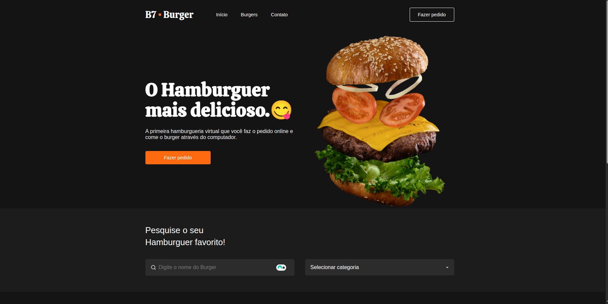

# 🍔 B7Burger – Landing Page

Este é um projeto de uma **landing page responsiva** para uma hamburgueria fictícia chamada **B7Burger**, feita a patir dos ensinamentos do curso de HTML/CSS da B7Web. O layout é projetado para se adaptar perfeitamente a diversas resoluções de tela.

---

## 🛠️ Tecnologias Utilizadas

- HTML5;
- CSS3.

---

## 📸 Preview do Projeto



---

## 📥 Como baixar o projeto

```bash
git clone https://github.com/erica-monteiro-developer/b7burger
cd b7burger
```
## 🌐 Acessar online no GitHub Pages
Você pode visualizar este projeto ao vivo acessando:

👉 <a style="color: #0f0;">https://erica-monteiro-developer.github.io/b7burger</a>

🙌 Agradecimentos
Este projeto foi desenvolvido com fins de aprendizado próprio, para resolver problemas propostos pela B7Web.
Sinta-se livre para usar, estudar ou adaptar como base para seus próprios projetos.